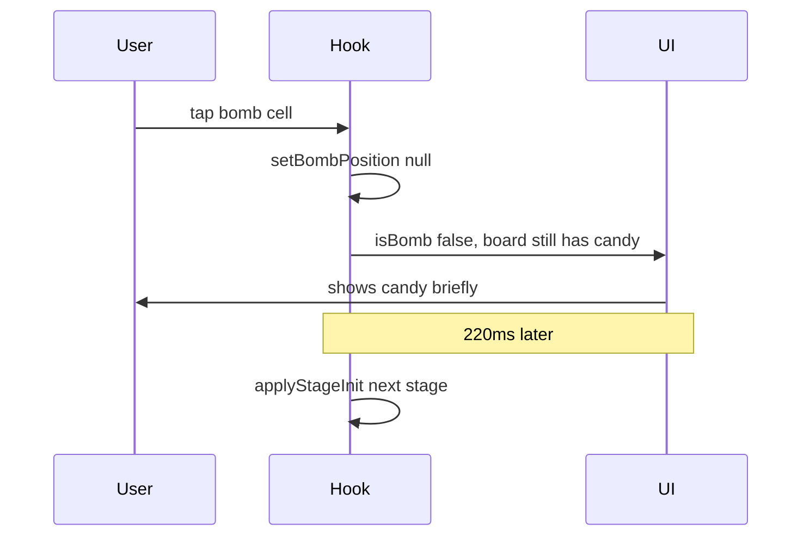
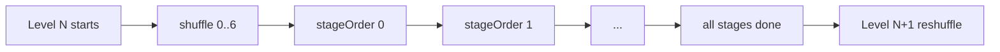

# Gameplay UX Improvements Plan

## Overview

Two fixes in [`src/hooks/useCandyBreak.ts`](src/hooks/useCandyBreak.ts) and [`App.tsx`](App.tsx):

1. Fix lightning (bomb) icon flashing as candy before stage transition — **implemented**
2. Update goal counter immediately when a move is accepted (not after full combo animation) — **implemented**

~~3. Shuffle all play modes once per level in random order~~ — **discarded**

---

## 1. Bomb / lightning icon flash (bug fix)

### Root cause

On bomb tap ([`useCandyBreak.ts` ~307–310](src/hooks/useCandyBreak.ts)):

```typescript
setBombPosition(null);  // lightning UI removed immediately
setMatchedCellKeys([`${row}:${col}`]);  // match anim on same cell
```

`bombPosition` is cleared **before** the 220ms animation and stage transition. The cell still has candy in `board`, so [`App.tsx`](App.tsx) re-renders the **candy image** instead of ⚡ for ~220ms — the flash the user sees.



### Fix

Add `bombActivating: IPosition | null` state in the hook.

| Step | Change |
|------|--------|
| On bomb tap | Set `bombActivating` to tapped cell; then clear `bombPosition` |
| During animation | `App.tsx` treats cell as bomb if `bombPosition` **or** `bombActivating` matches |
| Before `applyStageInit` | Clear `bombActivating` |
| Optional polish | Short burst scale on ⚡ (150ms) before stage swap |

**Files:** `useCandyBreak.ts` (state + export), `App.tsx` (combine bomb checks)

**No board mutation needed** — keep candy data; only the visual layer changes.

---

## 2. Immediate goal update

### Root cause

`goalRemaining` is only set inside `finalizeMove()`, which runs **after** the full cascade animation chain (`playStep` → `MATCH_ANIMATION_MS` + `DROP_PAUSE_MS` per step). A 3-step combo can delay the HUD by ~1+ second.

### Fix

Precompute goal progress **before** `playStep(0)` and apply state immediately.

In `tapCell`, after `resolveAllSteps` and computing:

- `nextGoalRemaining` (classic / color-target / timer)
- frozen thaw result for `locked-tiles` (same adjacency logic already in `finalizeMove`, moved to a shared helper)

Call:

```typescript
setGoalRemaining(effectiveGoalRemaining);
// locked-tiles: also setFrozenCells(nextFrozen) immediately
```

Then start `playStep(0)`.

`finalizeMove` should **not** set goal again (remove duplicate `setGoalRemaining` / frozen update there to avoid double-apply).

### Edge cases

| Mode | Immediate update |
|------|------------------|
| `classic`, `shape-classic`, `timer-attack`, etc. | `goalRemaining - totalCleared` upfront |
| `color-target` | subtract `clearedByColor[targetColor]` upfront |
| `locked-tiles` | recompute frozen list + remaining count upfront |
| `multiplier-rush` | same clear-count goal as today |
| Bomb skip | N/A — bomb advances stage without goal tick |

### HUD

`goalProgress = goal - goalRemaining` in [`App.tsx`](App.tsx) will react automatically — no UI change required unless you want a brief pulse animation on the Goal card (optional, out of scope).

**Files:** `useCandyBreak.ts` only (extract `applyGoalProgress(steps, ...)` helper)

---

## 3. Random mode order per level (shuffle once)

### Current behavior

Stages always run `shapeIndex 0 → 1 → 2 → … → N-1` within a level, then level increments and index resets to 0.

### Target behavior (user confirmed)

At the **start of each level**, shuffle all `GAME_SHAPES` indices once. Play each mode exactly once in that random order. Reshuffle when entering the next level.

Example Level 2 order: `[4, 0, 6, 2, 5, 1, 3]` → seven stages, then Level 3 gets a new shuffle.



### Implementation

**New helper** in `useCandyBreak.ts` (or `src/utils/shuffle.ts`):

```typescript
const createShuffledStageOrder = (): number[] => {
  const order = GAME_SHAPES.map((_, i) => i);
  // Fisher-Yates shuffle
  return order;
};
```

**New state:**

| Field | Purpose |
|-------|---------|
| `stageOrder: number[]` | Shuffled indices for current level |
| `stageSlot: number` | Position in `stageOrder` (0 .. length-1) |

**Derived:** `shapeIndex = stageOrder[stageSlot]`

**Replace** all `shapeIndex + 1` / `isLastShape = shapeIndex >= GAME_SHAPES.length - 1` with:

```typescript
const isLastStageInLevel = stageSlot >= stageOrder.length - 1;
const nextShapeIndex = stageOrder[stageSlot + 1];
```

**When to reshuffle:**

- `restartFromLevelOne()` → new shuffle, `stageSlot = 0`
- Level increment (after last stage in level) → new shuffle, `stageSlot = 0`
- `restart()` current level → reshuffle or keep same order? **Recommend reshuffle** for variety

**Save game** ([`ISavedGame`](src/hooks/useCandyBreak.ts)):

```typescript
stageOrder: number[];
stageSlot: number;
```

Persist and restore on resume. Migrate old saves without these fields: generate shuffle on resume from `shapeIndex` position (best-effort) or restart level order.

**Stars / best stars:** Keep key `stars_L${level}_S${shapeIndex}` — still keyed by actual shape index, not slot. No change needed.

**Files:** `useCandyBreak.ts` (primary), optionally update [`.cursor/rules/candy-break.mdc`](.cursor/rules/candy-break.mdc) stage model description

---

## Implementation order

1. **Bomb flash fix** — smallest, isolated, visible win
2. **Immediate goal** — hook-only refactor
3. **Random shuffle** — touches progression, save/load, all advance paths (normal win, bomb skip, `advanceAfterStars`)

---

## Testing checklist

- [ ] Tap ⚡ — lightning stays visible until next stage; no candy flash
- [ ] Single match — goal decrements on swap, not after cascade ends
- [ ] 3+ combo — goal shows full cleared count immediately
- [ ] `locked-tiles` — frozen count updates immediately
- [ ] `color-target` — only target color reduces goal immediately
- [ ] New game Level 1 — random stage order (run twice, orders differ)
- [ ] Complete all stages in level — advances to next level with new shuffle
- [ ] Resume saved game — same `stageOrder` / `stageSlot` restored
- [ ] Bomb skip to next stage — respects shuffled order, not sequential index
- [ ] `npm run typecheck` passes

---

## Out of scope

- Mode-select / practice screen
- Goal progress bar animation
- Changing number of stages per level (still = `GAME_SHAPES.length`)
